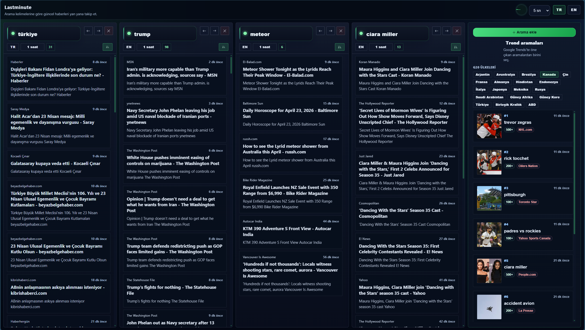

# Lastminute



Lastminute is a compact multi-tab news dashboard built on top of Google News RSS. It lets you track multiple topics side by side, switch languages, adjust freshness, and keep the interface fast and focused.

## Features

- Multi-tab news dashboard with side-by-side topic cards.
- Start with default searches for World, Economy, and Technology.
- Add, edit, reorder, and delete tabs.
- Per-tab language toggle, region, keyword, freshness, and sort order.
- Google News freshness filters from `1h` to `1d`.
- Auto-refresh intervals from `5s` to `1h`.
- Read-state tracking for news items.
- Google Trends suggestions in the right panel, grouped by country and ready to open as searches.
- English and Turkish localization with browser-language defaults.
- Netlify-ready RSS proxy via `/api/feed`.
- Netlify-ready Google Trends proxy via `/api/trends`.

## Tech Stack

- Vanilla HTML, CSS, and JavaScript
- Node.js local dev server
- Netlify Functions for RSS proxying

## Run Locally

```bash
node server.js
```

Then open:

```text
http://localhost:8080
```


## Project Structure

- `index.html` - app shell and templates
- `app.js` - UI logic, tab state, refresh handling, and RSS parsing
- `styles.css` - theme, layout, and responsive styling
- `server.js` - local development server
- `netlify/functions/feed.js` - RSS proxy for production
- `netlify/functions/trends.js` - Google Trends proxy for production
- `images/screenshot.jpeg` - project screenshot
